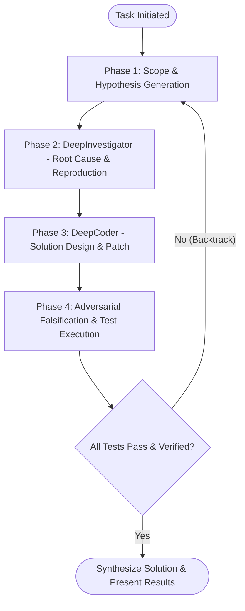

# Boost: Deep Multi-Agent Reasoning Pipeline

The **Boost** skill transforms the agent from a single-turn code generator into a structured, three-tier reasoning engine. It enforces strict separation between **investigation** and **implementation**, explores multiple hypotheses before making edits, and validates all solutions with adversarial verification loops.

---

## When to Activate This Skill

Activate this skill when:
- Resolving **flaky tests**, **race conditions**, **memory leaks**, or **deadlocks**.
- Tackling non-trivial **algorithmic optimizations** or architectural refactoring.
- Debugging complex errors where initial fixes repeatedly fail or produce regressions.
- The user explicitly requests deep thinking, rigorous verification, or mentions `/boost`.

---

## Core Operational Workflow

Follow this 4-phase lifecycle for all boost tasks:

### Phase 1: Scope & Hypothesis Generation (Orchestrator)
1. **Deconstruct the problem**: Break down the symptom into underlying components and invariants.
2. **Formulate a Hypothesis Tree**: Generate at least 2–3 competing hypotheses explaining the failure or potential solution paths.
   - Use [resources/hypothesis-tree-template.md](./resources/hypothesis-tree-template.md) to record hypotheses.
3. **Allocate a reasoning budget**: Set maximum iteration loops and define clear stopping conditions.

### Phase 2: Root Cause Investigation (`DeepInvestigator`)
Before modifying any source files, launch or assume the role of **`DeepInvestigator`**:
- **Constraint**: **Read-Only Inspection**. Do NOT edit business logic or source code during this phase.
- **Trace the callstack**: Inspect log outputs, stack traces, and variable lifecycles.
- **Write a Minimal Reproduction Test**: Create an automated test or script that deterministically reproduces the bug or benchmarks the baseline performance.
- Confirm the hypothesis with empirical evidence before proceeding to Phase 3.

> See [references/hierarchy.md](./references/hierarchy.md) for full details on the `DeepInvestigator` role and subagent specifications.

### Phase 3: Solution Architecture & Patch (`DeepCoder`)
Once the root cause is proven by test:
- Transition to the **`DeepCoder`** role to craft the minimal, correct patch.
- Adhere strictly to existing architectural patterns, type safety, and interface contracts.
- Avoid extraneous changes or speculative refactoring outside the verified problem scope.

### Phase 4: Adversarial Falsification & Backtracking
Never consider a task complete simply because code was written:
1. **Regression & Suite Run**: Execute the existing test suite and the newly created reproduction test in a sandboxed worker.
2. **Adversarial Falsification**:
   - Actively construct edge-case tests, concurrent stress tests, or boundary conditions designed to break the patch.
3. **Backtracking**:
   - If the patch fails verification or introduces side effects, discard the invalid assumptions, update the Hypothesis Tree, and backtrack to the next viable branch.

> See [references/verification-protocol.md](./references/verification-protocol.md) for the complete Zero-Trust Verification protocol.

---

## Subagent Delegation Guidelines

When running in Antigravity environments that support subagents (`invoke_subagent`):
1. **Spawn `DeepInvestigator`** using the read-only research subagent profile to inspect logs, trace source code, and run non-modifying diagnostics.
2. **Spawn `DeepCoder`** with write permissions only after receiving a definitive diagnosis.
3. **Spawn Isolated Workers** to run terminal builds and test commands so errors and verbose logs do not pollute the primary conversation context.

---

## Quick Reference Links
- [Architecture & Multi-Agent Hierarchy](./references/hierarchy.md)
- [Verification & Adversarial Protocol](./references/verification-protocol.md)
- [Hypothesis Tree Template](./resources/hypothesis-tree-template.md)
