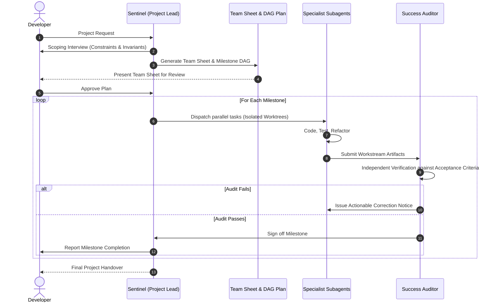

# Teamwork: Autonomous Multi-Agent Teams

The **Teamwork** skill coordinates an autonomous team of specialized subagents to tackle long-horizon, multi-step engineering projects. It structures work through blueprint selection, milestone decomposition, role specialization, and independent audit gates.

---

## When to Activate This Skill

> MANUAL-ONLY: run only on explicit user request (`/k-teamwork-preview`,
> `/prompt-toolkit:k-teamwork-preview`, `$k-teamwork-preview`, or "use the
> k-teamwork-preview skill"). Never auto-trigger.

Activate this skill when:
- Executing **repository-wide migrations** (e.g. migrating from Vue 2 to Vue 3, CommonJS to ESM, React class components to hooks).
- Building **complete subsystems or full-stack features** spanning multiple directories, APIs, and database schemas.
- Conducting **deep technical research** involving multi-branch strategy exploration and proof synthesis.
- The user explicitly mentions `/k-teamwork-preview`, autonomous agent teams, or asks for a structured team approach.

---

## Lifecycle & Operational Workflow

Follow this 4-phase execution lifecycle:

### Phase 1: Scoping & Intake Interview (Sentinel)
Before spawning any worker agents, act as or designate the **`Sentinel`**:
1. **Clarify Objectives**: Understand the end state, target tech stack, and non-negotiable architectural boundaries.
2. **Determine Blueprint**: Select the optimal execution pattern (see [references/blueprints.md](./references/blueprints.md)):
   - **Distributed Coding**: For decomposable, parallelizable engineering tasks.
   - **Iterative Coding**: For tightly coupled, test-driven implementations.
   - **Long Proof / Deep Research**: For open-ended research, benchmarking, and multi-hypothesis evaluation.
3. **Capture Acceptance Criteria**: Define exact binary completion tests (build commands, linters, coverage targets).

### Phase 2: Team Sheet Generation & DAG Decomposition
Create a formal **Team Sheet** before touching any production files:
- Use [resources/team-sheet-template.md](./resources/team-sheet-template.md) to define:
  - **Specialist Roles**: Exactly what agents are deployed (e.g. Backend Engineer, Frontend Specialist, Migration Worker).
  - **Milestone DAG**: Directed Acyclic Graph of dependencies, ensuring blockers are solved first.
  - **Review Gates**: Specific deliverables and checks required per milestone.
- **Stop for Developer Approval**: Present the Team Sheet and obtain explicit confirmation before proceeding to execution.

### Phase 3: Autonomous Parallel Execution
Once approved:
1. **Isolate Workspaces**: Execute work across separate Git branches or worktrees (`git worktree add`) to prevent concurrent file conflicts.
2. **Assign Specialist Subagents**: Dispatch subagents (`invoke_subagent`) equipped with targeted roles and scoped file access.
3. **Cross-Agent Communication**: Specialists share progress via structured artifacts and message queues without flooding the primary user chat.

### Phase 4: Independent Success Audit
A dedicated **`Success Auditor`** must independently review every completed milestone:
- The `Success Auditor` has **NEVER written code** for this milestone (guaranteeing impartiality).
- Evaluates code against [resources/audit-checklist-template.md](./resources/audit-checklist-template.md).
- Only when the Auditor signs off does the Sentinel advance to the next milestone in the DAG.

---

## Governance & Resource Management

- **Context Isolation**: Always maintain clean contexts by delegating heavy tasks to subagents and reporting back high-level summaries.
- **Early Termination**: The Sentinel must pause and request guidance if an unresolvable blocker or major design ambiguity is discovered during execution.

---

## Quick Reference Links
- [Blueprints & Execution Patterns](./references/blueprints.md)
- [Roles & Team Governance](./references/roles-governance.md)
- [Team Sheet Template](./resources/team-sheet-template.md)
- [Success Audit Checklist Template](./resources/audit-checklist-template.md)
