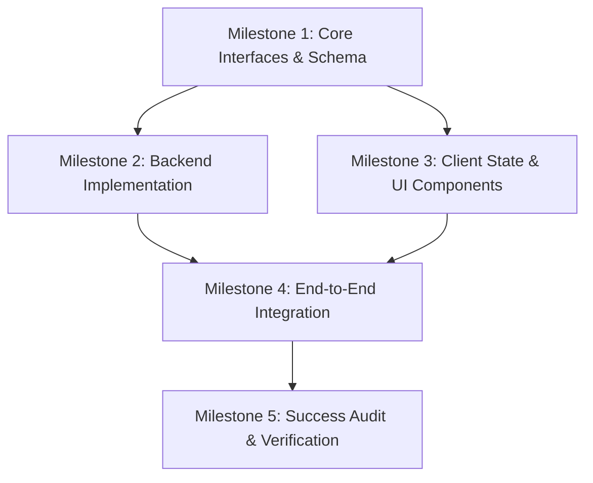

# Team Sheet: [Project Name]

> **Status**: PROPOSED / APPROVED / IN_PROGRESS / COMPLETED  
> **Selected Blueprint**: [Distributed Coding / Iterative Coding / Long Proof & Research]  
> **Lead Orchestrator (Sentinel)**: [Sentinel Agent]  

---

## 1. Project Objective & Acceptance Criteria
- **High-Level Objective**: [Clear statement of the desired project outcome]
- **Target Subsystems**: [List directories, packages, or services affected]
- **Binary Acceptance Criteria**:
  - [ ] Build succeeds: `[e.g. npm run build]`
  - [ ] Test suite green: `[e.g. pytest tests/ -v]`
  - [ ] Type check passes: `[e.g. npx tsc --noEmit]`
  - [ ] Lint clean: `[e.g. ruff check .]`

---

## 2. Team Roster & Role Specialization

| Agent Name / ID | Role / Specialization | Scope / Assigned Paths | Isolation Mechanism |
| :--- | :--- | :--- | :--- |
| **Sentinel** | Lead Orchestrator | Entire Project & DAG | Main Conversation Context |
| **Specialist-1** | [e.g. Backend API Builder] | `src/server/`, `src/api/` | Worktree `wt-backend` |
| **Specialist-2** | [e.g. Frontend UI Builder] | `src/client/`, `src/components/` | Worktree `wt-frontend` |
| **Auditor** | Success Auditor | Independent Validation | Clean Sandbox Runner |

---

## 3. Milestone DAG (Directed Acyclic Graph)

### Milestone Details

#### Milestone 1: [Name]
- **Owner**: [Agent Name]
- **Deliverables**: [Specific files or artifacts]
- **Dependencies**: None
- **Verification Gate**: [Build command / test runner]

#### Milestone 2: [Name]
- **Owner**: [Agent Name]
- **Deliverables**: [Specific files or artifacts]
- **Dependencies**: Milestone 1
- **Verification Gate**: [Build command / test runner]

---

## 4. Human Approval
- [ ] **Developer Sign-off received on Team Sheet**: [Date / Confirmation]
